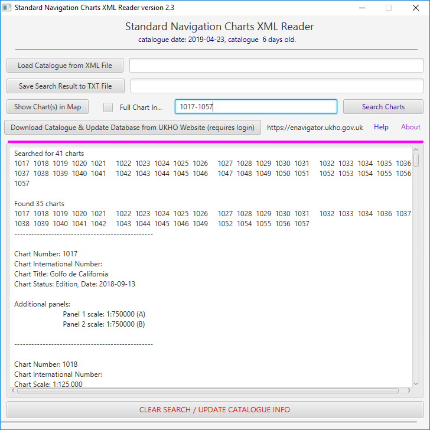
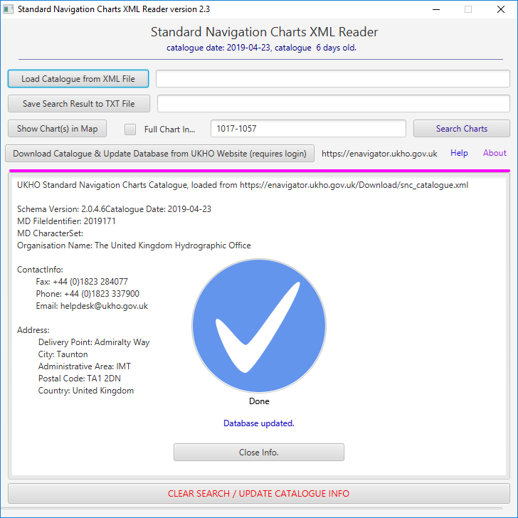
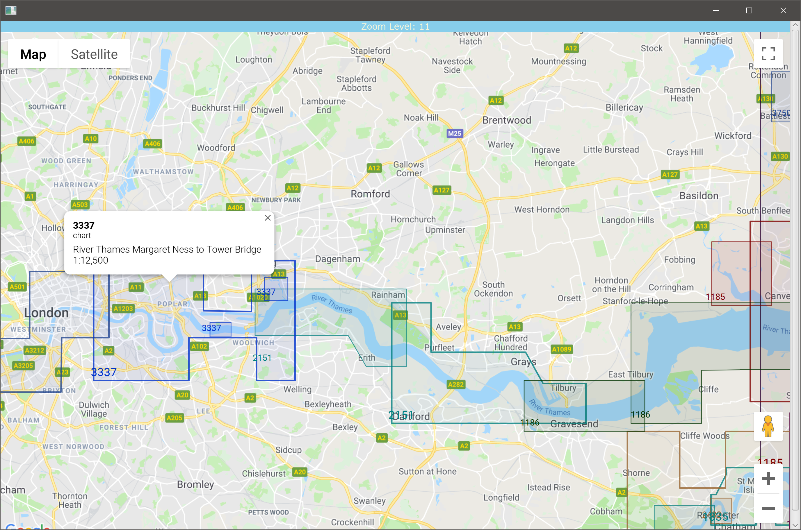

# SncXmlReaderFXDB

A UKHO Standard Navigation Chart reader with an option to display charts' coverage.
## Table of contents
* [General Info](#general-info)
* [Screenshots](#screenshots)
* [Technologies](#technologies)
* [Setup](#setup)
* [Launch](#launch)
* [Features](#features)
* [Restrictions](#restrictions)
* [Status](#status)
* [License](#license)
* [Contact](#contact)

# General Info
The United Kingdom Hydrographic Office issues a digital catalogue for their Standard Paper Charts in XML format. It is not very user friendly to use. Hence the idea to make it a bit simpler to search for info about charts by building a simple Graphic User Interface where information would be diplayed in a succint and easy on the eyes form. Later, on top of the above a feature allowing display charts coverage as polygons on Google Maps backgroud was added.

# Screenshots

	
	
	
	

# Technologies
- Java JDK 1.8
- JavaFX 2.0
- Maven 3.60
- Scene Builder
- started on Eclipse, then switched to IntelliJ IDEA. 

**Plugins and libraries**
- Maven Compiler plugin 3.8.0
- Maven Site plugin version 3.6
- Maven Antrun plugin version 1.8
- Maven Shade plugin version 2.4.1
- Maven Assembly plugin  version 2.4
- Maven Surefire plugin  version 2.22.0
- JUnit5  version 5.4.1
- AssertJ version 3.12.2
- Launch4j version 1.7.25
- SF4j version 1.7.5
- Apache CommonsIO version 2.6
- Apache HTTPComponents version 4.5.7
- Dizitart Nitrite Database version 3.1.0
- JSoup library 1.11.3
- JCoord library 1.0
- Google Maps Javascript API version 3

# Setup

Clone the repository to a folder on your computer and import it in your favourite IDE as a Maven project.

### Build

Run - *mvn clean package* - it creates an executable .jar (with all the dependencies included) as well as a Windows .exe wrapper of the same .jar. Also, necessary folder/file structure is copied next to the executable files (*user.data* folder and its content). All of it is then packed in a ZIP file format for portability as a release version.

# Launch
### Prerequisities
- Java JRE or JDK 1.8.0 or later
### Setup
To start using the app:
- download *SncXmlReaderFXDB-X.X.X.X-release.zip* file (where *X.X.X.X* is the current version number) from the [release/] folder to your computer and unpack it. The unpacked folder  *SncXmlReaderFXDB-X.X.X.X* will consist of **SncXmlReader_2.3.0.0.exe** and **SncXmlReaderFXDB-2.3.0.0-shaded.jar** files as well as **user.data** folder.
- you can start the app double clicking on the **.exe** file or run it from the command line passing additional parameters to JVM.
- **user.data** folder content:
    - ***config.properties*** file - configures paths to *.xml* catalogue and *.db* database files, also stores Google Maps Javascript API key without which displaying charts polygons will not work
    - ***GoogleMaps API KEY.txt*** file - Google Maps Javascript API key delivered with the app
    - ***html*** folder - for all the html files generated by the app
    - ***db*** folder - for database files
    - ***xml*** folder - for downloaded catalogue files
    - ***txt*** folder - for search result saved files
    - ***log*** folder - for a log file
- before you start the app copy the delivered Google Maps API key from *GoogleMaps API KEY.txt* file to *config.properties* file at the appropriate place (self-explanatory)
- once you started the app and the info line right below the app title says "no catalogue loaded", load the file manually from the **/user.data/xml/..**
And that is it! Now you can search for charts and see their coverage displayed on Google Maps. For more details how to use the *SncXMlReaderFXDB* app see [How To Use](#how-to-use)

# Features
**Searching for charts**
- looking for an exact match enter:
    - a single chart number followed by '=' (equals) eg. '23='
	 - a few chart numbers separated with ',' (comma) eg. '23, 25 ,27'
	 - a range of charts separated with '-' (hyphen) eg. '67-45'
	 - any combimation of the above eg. 23,45,67,254-256,nz67-45, aus12-aus34' (spaces between digits will be removed during processing, numbers joined and treated as one chart number)
- to broaden your search enter:
    - a single number not followed by '=' eg. '23' - finds all the charts that overlap or border with the searched one
    - a single number followed by '+' (plus) eg. '23+' - finds all the charts that:
        - overlap or border with the searched chart
        - have roughly equal or larger scale and their centre is not farther than 300km from the centre of the searched chart
    - a single number followed by '-' (minus) eg. '23-' - finds all the charts that:
        - overlap or border with the searched chart
        - have roughly equal or smaller scale and their centre is not farther than 300km from the centre of the searched chart

**Displaying Charts Coverage**
- you can display charts coverage in a separate window as polygons on top of Google Maps. Charts shown on the map are the same as in the search result. That means to display any chart's coverage you need to search for it first. If you try to display too many charts (more than 100) the map might be a bit less responsive on older computers. 
- charts polygon colours are drawn from a small pool of colours to improve legibility. 
- when you click inside a chart polygon a tooltip containing basic information about the chart will appear. Info includes chart's number, name, whether it is a main chart panel or one of its insets (additional panels) along with the scale aof the panel.
- every time you try to display charts an HTML file is generated and saved in */user.data/html/...* folder. The file's name contains of all the charts numbers that have been found during your last search. If the length of the name exceedes 240 characters the range of chart numbers (the first and the last one) is used for the name.
- the generated HTML files are full, stand alone HTML pages with a Javascript script and Google Maps Javasript API KEY included. You can open those files in any major internet browser; however, IE and Edge have been tested.
- you can keep as many Map Windows opened as you like, you do not have to close a map window to conduct and display another search.

# Restrictions
- If you have been issued with a specific Google Maps Javasript API KEY this key is restricted in use to the IP's of the computer's domain (domain the SncXmlReaderFXDB application is installed on) and will not work on computers connected to a different network. If you want to use this funcionality (displaying charts) on computers connected to a different network you need to provide your own Google Maps Javascript API key. You can supply your own API key by replacing the original API key manually in *config.properties* file. The same restriction applies to all automatically generated HTML files, they will not work if copied and opened on computers connected to a different network.

**Note**

An HTML file will still be generated but it will not work until the API key is not replaced (in the file itself) with a valid one.
- If you are using Google Maps Javasript API KEY provided in this repository
there is no IP restrictions. There is, however, a restriction on monthly usage and the limit depends on my financial situation

- You will know if you hit any of the above restrictions when you see this screen in the map window trying to display charts coverage:

If you have never used any of Google Maps official APIs you can register with Google as a developer and have the first year of using their APIs free of charge (with some minor limitations).

# Status
In progress

Stage:
- bug fixing and minor improvements especially to the search algorithm

Planned:
- pssibility of adding NGA and NOAA charts if data source found

# License
SncXmlReaderFXDB is free software: you can redistribute it and/or modify it under the terms of the GNU General Public License as published by the Free Software Foundation, either version 3 of the License, or (at your option) any later version.
SncXmlReaderFXDB is distributed in the hope that it will be useful, but WITHOUT ANY WARRANTY; without even the implied warranty of  MERCHANTABILITY or FITNESS FOR A PARTICULAR PURPOSE.  See the GNU General Public License for more details.
You should have received a copy of the GNU General Public License along with SncXmlReaderFXDB.  If not, see http://www.gnu.org/licenses/ or write to: latidude99@gmail.com

# Contact
You can email me at latidude99@gmail.com

